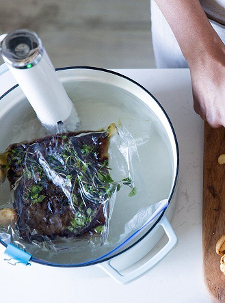

# JouleUWP

Unofficial Windows 10 UWP App (phone, desktop, hololens, xbox) for ChefSteps Joule Sous-vide device.
This is only my fork of [Mitch Capper' JouleUWP](https://github.com/mitchcapper/JouleUWP) app.

Draft. Research phase.

## Screenshots

## References
- https://github.com/mitchcapper/JouleUWP  The original JouleUWP app (or unoriginal... idk))
- https://github.com/mitchcapper Mitch Capper, Great Reverse Engeneer and Developer
- https://medium.com/@_dennisli/reverse-engineering-the-chefsteps-joule-and-making-a-chrome-extension-fa09c78bd87f Reverse engineering the ChefSteps Joule (and making a chrome extension)
- https://www.youtube.com/watch?v=goPv_ClIndM Chrome Joule - (unofficial) chrome extension to control your ChefSteps Joule (Youtube video)
- https://github.com/li-dennis/chromeJoule Chrome extension to control ChefSteps' Joule 

## ..

AS IS. No support. RnD only.

## .

[m][e] 2002 